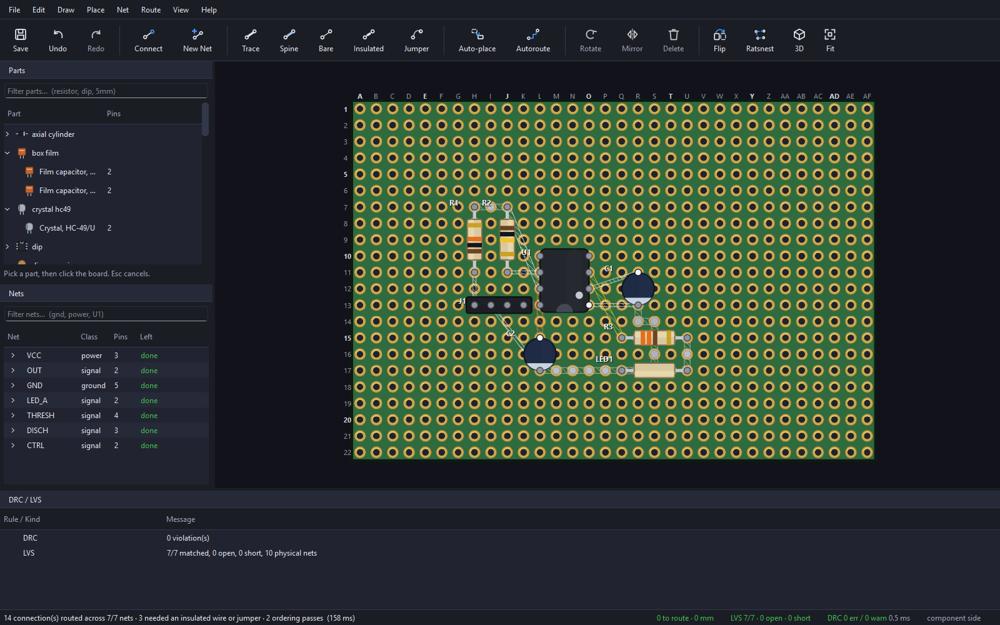
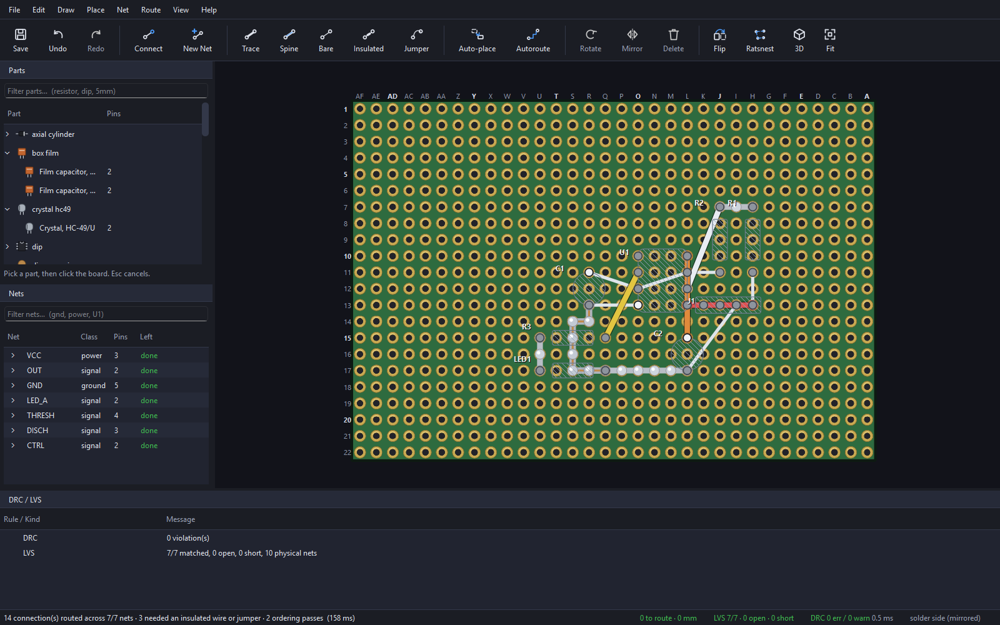
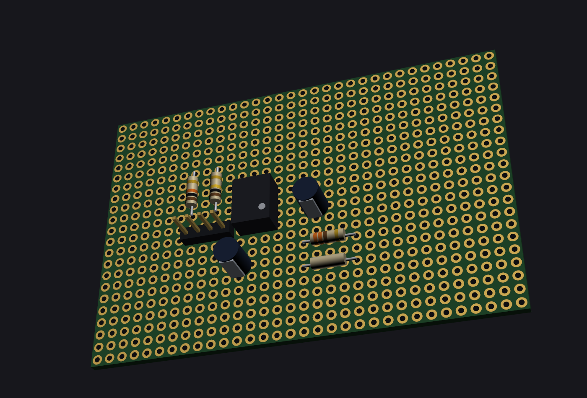
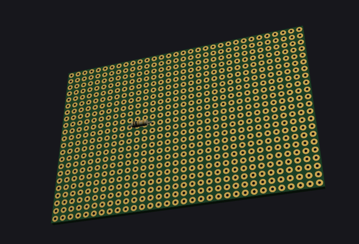

# PerfStudio

[](https://github.com/medinstech/perfstudio/actions/workflows/ci.yml)
[](./LICENSE)
[](https://www.python.org/downloads/)

[English](./README.md) · **Türkçe**

Delikli plaket (perfboard) üzerinde devre tasarlayın — tıpkı bir PCB'de yaptığınız gibi —
ve gerçekten uygulayabileceğiniz bir lehimleme rehberi alın.



> **Durum: pre-alpha, ve uçtan uca çalışıyor.** Netlist giriyor, lehimleme rehberi
> çıkıyor: 2D editör, 3D görünüm, yerleştirme optimizasyonu, otomatik router, DRC, LVS,
> montaj rehberi, birebir (1:1) PDF çıktısı ve bir MCP sunucusu. Eksik olan tek şey
> dogfood testi — henüz kimse üretilen bir rehberi takip ederek gerçek bir kart
> lehimlemedi ve [PLAN.md](./PLAN.md) §11'e göre bu olmadan M5 kapanmıyor. Gerisi
> çalışıyor: **v0.4.0** üç masaüstü platformunun her biri için bir kurulum paketi
> yayınlıyor, hiçbiri kod imzalı değil.

---

## Ne yapar

Bir şema netlist'ini alır, delik-başına-pad plaket üzerine yerleştirir, bağlantıları
router'a çözdürür, sonucun şemayla birebir örtüştüğünü kanıtlar ve ölçüm kontrol
noktaları içeren adım adım bir montaj rehberi üretir.

**Mevcut araçlardan ayrıldığı üç nokta:**

1. **Doğrulama adımları olan bir lehimleme rehberi.** Sadece "R1'i buraya lehimle" değil;
   *"blok 2 bitti → U1 pin 4 ile C3(−) arasında süreklilik olmalı"* ve *"güç vermeden
   önce: GND ile V+ arası 10 kΩ üzerinde okumalı"*. Netlist'ten türetildiği için genel
   tavsiye değil, o karta özel.
2. **Perfboard için LVS.** Kartın gerçek bağlantısallığı çıkarılır ve şemayla
   karşılaştırılır. Açık devreler, kısa devreler ve boşta kalan iletkenler havyayı elinize
   almadan önce raporlanır.
3. **Ajan-dostu.** MCP sunucusu, headless CLI ve git ile diff alınabilen proje dosyası;
   hepsi GUI ile aynı komut veri yolunu (command bus) kullanır — yani bir insanın ve bir
   modelin aynı oturumda birlikte çalıştığı bir kartta geri alma (undo) çalışır.

## Her bağlantı aynı şey değildir

Çoğu araç perfboard bağlantısını "bir tel" olarak modeller. Oysa perfboard'da iki noktayı
birleştirmenin, her birinin kendi maliyeti, sınırı ve arıza biçimi olan **altı** fiziksel
yolu vardır — ve router'ın gerçekten lehimlemesi keyifli bir yerleşim üretebilmesinin
sebebi tam olarak bu farkı modellemesidir:

| | nedir | notlar |
|---|---|---|
| bacak bükümü | komponent bacağının yakın bir deliğe bükülmesi | pratikte bedava, 3–4 delik |
| **lehim yolu** | komşu pad'lerin yalnızca lehimle birleştirilmesi | sadece dik (ortogonal); yan pad'e ~0,6 mm |
| **lehim yolu, omurgalı** | aynısı, kalaylı tel omurga üzerinde | ~10× daha düşük direnç, uzunluk sınırı yok |
| çıplak tel | lehim yüzeyinde kalaylı tel | başka bir çıplak iletkenle kesişemez |
| yalıtımlı tel | serbestçe kesişebilir | hazırlık süresi maliyeti var |
| üst jumper | komponent yüzeyinden atlayan yalıtımlı jumper | görünür, gövde alanı işgal eder |

Komşu pad'e olan 0,6 mm'lik boşluk, lehim yollarını hem bu kadar kullanışlı hem de bu
kadar kolay yanlış yapılır kılan şeydir. PerfStudio bu riski router'ın maliyet
fonksiyonuna işler ve işaretlenen her noktayı montaj rehberinde bir ölçüm adımına
dönüştürür.

## İki yüz, ve üçüncü boyut

Bakır lehim yüzeyindedir; bu yüzden lehim yüzeyi bir "ayna modu" değil, tam yetkili bir
görünümdür — ve **bakmadığınız** yüzdeki bakır taralı çizilir, çünkü kart saydam değildir
ve dolu çizilen bir iletken *bu senin önünde* der.



3D görünüm bir resim değil, bir kontrol aracıdır. Yukarıdan bakışın hiçbir şekilde
göremeyeceği üç kural vardır: kutuya sığmayacak kadar yüksek bir parça, üzerine
lehimlenecek bir gövdenin altında sıkışan bir jumper, ve sıcak bir parçaya fazla yakın
duran ısıya duyarlı bir parça.



## Rehberin bir sırası var, ve onu izleyebilirsiniz



Parçalar **en kısadan başlayarak** takılır — erken takılan yüksek bir parça, kısa olanlar
lehimlenirken kartın tezgâha düz yatmasını engeller. Sonra kart ters çevrilir ve bakır
işlenir; entegreler ısı ile ESD nedeniyle en sona kalır. Bir parçanın gövdesi altında
sıkışıp kalacak bir jumper **ilk** faza alınır, çünkü o parça yerine lehimlendiğinde artık
çok geçtir.

Animasyon kartı ortada ters çeviriyor, çünkü siz de öyle yaparsınız: perfboard saydam
değildir ve bu montajın yirmi iki adımının on dördü yukarıdan göremediğiniz yüzde
gerçekleşir. Animasyon, 3D panelindeki montaj kaydırıcısının çağırdığı fonksiyonun aynısı
oynatılarak üretiliyor — yani rehberin gerçekten vermediği bir sırayı gösteremez.

## Çalıştırmak

**Python 3.12+** gerekir. Masaüstü uygulaması PySide6 (Qt 6) ve VTK viewport kullanır.

```sh
git clone https://github.com/medinstech/perfstudio.git
cd perfstudio
pip install -e .

perfstudio                   # boş bir kartla başlat
perfstudio bir/kart.perf     # ...ya da bir doküman aç
perfstudio --version
```

Ya da kurun: **[releases sayfası](https://github.com/medinstech/perfstudio/releases)**
Windows kurulum paketini, Linux AppImage'ını ve macOS disk imajını taşıyor; üçü de
etiketin kendisi tarafından üretilip smoke-test ediliyor. **Hiçbiri kod imzalı değil**,
o yüzden her biri ilk açılışta uyarı veriyor ve release notları uyarının nasıl geçileceğini
yazıyor — Windows EV sertifikası yılda ~$300, Apple notarization $99. Kaynaktan
çalıştırmak bu uyarıyı tamamen atlıyor. Bkz. [docs/RELEASING.md](./docs/RELEASING.md).

Arayüz **İngilizce ve Türkçe** konuşur (`--lang tr`, ya da sistem diline göre otomatik).

### Sıfırdan bir kart

Uygulamada: `examples/ne555-astable.net` üzerinde **File → Import KiCad Netlist**, önerilen
yerleşimi kabul edin, **Place → Auto-place Board** (`Ctrl+Shift+A`), route için **`Ctrl+R`**,
ardından **File → Export Build Guide** (`Ctrl+B`). Yukarıdaki ekran görüntüleri tam olarak
bu sıradan çıkıyor — bkz. [`tools/screenshots.py`](./tools/screenshots.py).

KiCad şart değil: netler uygulama içinde elle ya da MCP üzerinden de kurulabilir.

### Ya da hazır bir kart açın

[Dört örnek](./examples/README.md) hem netlist hem de bitmiş kart olarak geliyor:

```sh
perfstudio examples/lm317-supply.perf
```

| | neyi göstermek için var |
|---|---|
| `ne555-astable` | başlangıç noktası — LED yakıp söndüren bir 555 |
| `lm317-supply` | TO-220 regülatör, yani ısı kuralının ölçecek bir şeyi var |
| `lpb1-booster` | **FR-2** üzerine kurulu — pad'leri kalkan pertinaks kart |
| `arduino-io-shield` | iki header; bir shield zaten büyük ölçüde budur |

Dördü de eksiksiz route ediliyor, LVS'te şemalarıyla örtüşüyor ve hiçbir DRC hatası
taşımıyor — `tests/test_examples.py` bunu her commit'te doğruluyor.

### Bir ajandan

MCP sunucusu birebir aynı komut veri yolunu sürer, dolayısıyla geri alma her ikisinde de
çalışır:

```sh
pip install -e ".[mcp]"
claude mcp add perfstudio -- python -m perfstudio.mcp
```

Kırk dört tool, ve her delik insanların perfboard'dan bahsederken kullandığı adresle
(`A1`, `C7`, `AC12`) — hiçbir yerde ham koordinat yok. Tool listesi, diğer istemcilerin
istediği JSON yapılandırması ve kurulumun geri kalanı için [docs/MCP.md](./docs/MCP.md).

### Headless

2D/3D/PDF'i dosyaya render eder, DRC ve LVS çalıştırır, süreleri yazdırır — ekran
gerekmeden. Görsel çıktının CI'da sınandığı yol budur ve bir render değişikliğinin bir
şeyi kırmadığını doğrulamanın en hızlı yoludur:

```sh
python -m perfstudio.ui.main --headless tools/diffcheck/golden/dense.perf
```

## Nasıl kurulmuş

Doküman **değişmezdir (immutable)** ve her mutasyon tek bir veri yolundan geçen bir
komuttur — insan ve ajanın karıştığı bir oturumda geri almayı çalıştıran şey budur.
Motor **saftır**: saat yok, RNG yok, dosya sistemi yok, `ui/` altında olmayan hiçbir yerde
Qt veya VTK yok. Yerleştiricinin tavlama (annealing) algoritması tohumludur (seeded);
aynı doküman ve aynı tohum aynı kartı verir.

Bu saflık süs değil, taşıyıcı bir kolondur. Buradaki Python motoru `packages/` içinde
duran TypeScript motorunun bir portudur ve kabul kriteri hiçbir zaman "testler geçiyor"
değil, "yerine geçtiği implementasyonla bayt bayt aynı sonucu üretiyor" olmuştur —
`tools/diffcheck/` altındaki golden fixture'lar, son IEEE-754 double'a kadar.

```
src/perfstudio/            motor: doküman modeli, komut veri yolu, bağlantısallık,
                           router, autorouter, yerleştirici, DRC, LVS, kalıcılık
src/perfstudio/guide.py    lehimleme rehberi; HTML/CSV/JSON için guide_export.py
src/perfstudio/stripboard.py  bakırı baştan bağlı gelen kart; striproute.py onun üstünde
                           tasarım yapan kes-ve-bağla planlayıcısı
src/perfstudio/parsers/    KiCad netlist içe aktarıcı
src/perfstudio/ui/         Qt uygulaması: 2D editör, VTK 3D görünüm, 1:1 PDF çıktısı,
                           ve headless.py: CI'ın çıktısını denetlediği ekransız koşu
src/perfstudio/mcp/        MCP sunucusu (docs/MCP.md)
examples/                  içe aktarılacak bir netlist
tests/                     1363 test; motor mypy --strict temiz
packages/                  Python portunun karşısında kanıtlandığı referans olarak
                           saklanan orijinal TypeScript motoru
```

61 adet THT footprint **sayısal parametrelerden üretilir**, hazır varlık olarak
gelmez — mesh kütüphanesi yok, devralınacak share-alike lisansı yok. Bir parçayı 2D'de
çizen spec, 3D'de gövdesini extrude eden spec ile aynıdır; dolayısıyla ikisi birbiriyle
çelişemez.

## Nereye gidiyor

Biten: editör, kütüphane, bağlantısallık ve LVS, DRC, router ve yerleştirme
optimizasyonu, render edilmiş adım görselleri ve montaj oynatması ile montaj rehberi,
1:1 PDF çıktısı, MCP sunucusu, TR/EN yerelleştirme, bir `v*` etiketiyle çalışan
üç platformluk paketleme, ve yeni sürümü haber verip indiren güncelleme denetimi
(**Yardım ▸ Güncellemeleri Denetle**; indirdiğini sürümün `SHA256SUMS` dosyasıyla
doğrulayıp size teslim eder — çalıştırmak sizin tıklamanız).

Sırada, [PLAN.md](./PLAN.md) §11'in koyduğu sırayla:

- **Dogfood montajı (M5).** Birinin, üretilmiş bir rehberi takip ederek gerçek bir kart
  lehimlemesi gerekiyor. Bu olana kadar bu sayfadaki her iddia, çalışan bir devre
  hakkında değil, yazılım hakkında bir iddiadır. Bu liste içinde bir yabancının proje
  için yapabileceği tek şey de bu — [bunun için bir issue şablonu var](./.github/ISSUE_TEMPLATE/board_i_could_not_build.yml).
- **Kod imzalama.** Windows EV sertifikası ~$300/yıl, Apple notarization $99/yıl; o zamana
  kadar kurulum paketleri ilk açılışta uyarı veriyor ve release notları bunun nasıl
  aşılacağını yazıyor.

## Katkı

Issue ve pull request'ler memnuniyetle karşılanır. Önce [CONTRIBUTING.md](./CONTRIBUTING.md)
dosyasını okuyun — test paketinin nasıl çalıştırıldığını, hangi kontrollerin kapı olup
hangilerinin olmadığını, ve burada çoğu projeden daha çok önem taşıyan bir lisans sınırını
anlatıyor: **bu alandaki GPL lisanslı araçların kaynak kodunu okumayın ve port etmeyin.**
PerfStudio onlara karşı clean-room geliştirilmiştir ve bunun böyle kalması gerekiyor.
Kayıt [docs/prior-art.md](./docs/prior-art.md) içinde.

## Lisans

Apache-2.0. Bkz. [LICENSE](./LICENSE) ve [NOTICE](./NOTICE).
